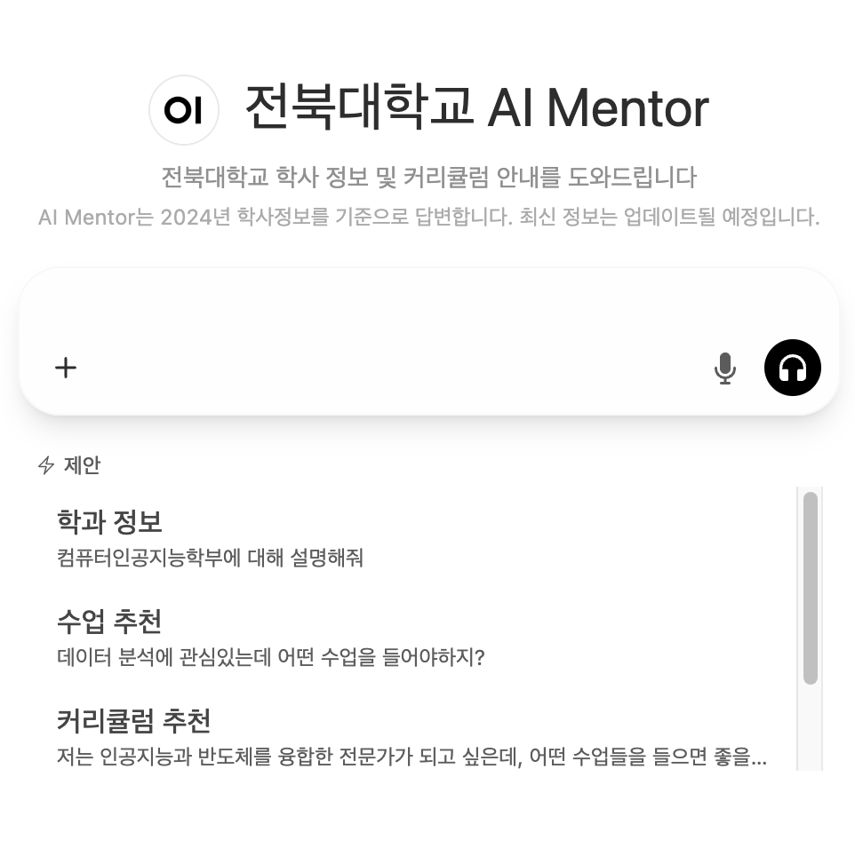
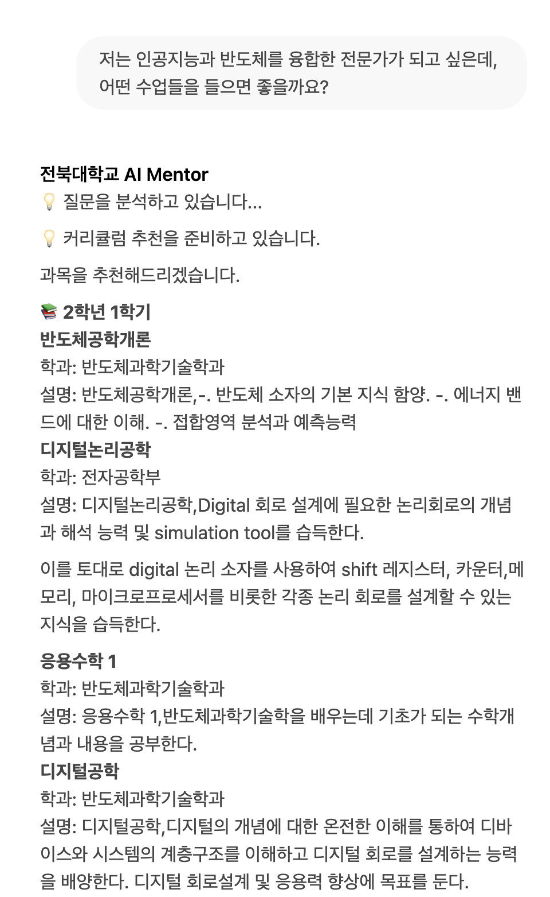
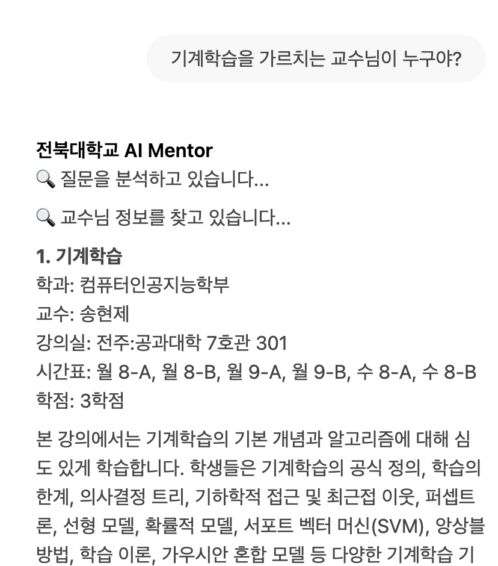
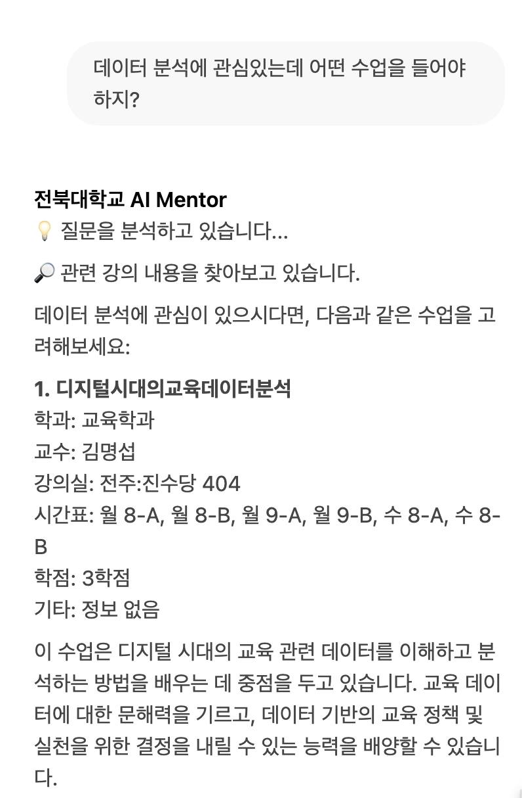
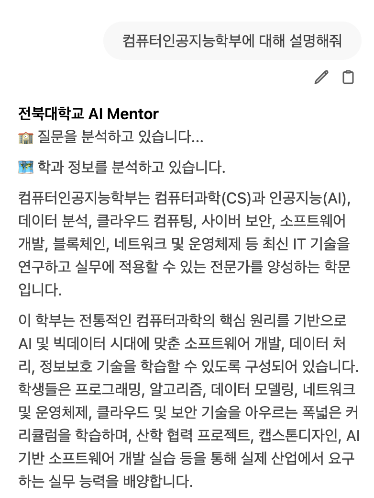

# JBNU AI Mentor

An AI-powered academic mentoring system for Jeonbuk National University students, providing personalized curriculum recommendations, course information, and academic guidance.

<p align="center">
  
</p>

## System Architecture

The system consists of multiple microservices communicating via HTTP APIs:
- **Open WebUI**: Web interface (Port 8080)
- **Pipeline**: Request routing and processing (Port 9099)
- **AI Modules**: Specialized microservices for different tasks

## Project Structure

```
AiMentor_edit/
├── open-webui/                  # Web UI application (Port 8080)
├── pipelines/                   # Request routing pipeline (Port 9099)
├── ai_modules/                  # AI microservices
│   ├── llm_agent-main/          # Main orchestration service with LangGraph (Port 8001)
│   ├── curriculum-main/         # Course recommendation and graph generation (Port 7996)
│   ├── faiss_search-main/       # Vector-based course search (Port 7997)
│   ├── department_mapping-main/ # Department mapping service (Port 8000)
│   └── tool_sql-main/           # Database query service (Port 7999)
├── docker-compose.yml           # Docker orchestration configuration
├── restart_all.sh               # Service restart script
└── Ai_mentor.png                # System interface screenshot
```

## Quick Start

### Using Docker Compose (Recommended)

```bash
# Start all services
docker-compose up -d

# View logs
docker-compose logs -f

# Stop all services
docker-compose down
```

Access the application at `http://localhost:8080`

### Live Demo

🌐 **Production Service**: [http://210.117.181.110:8080](http://210.117.181.110:8080)

### Manual Setup

#### Prerequisites
- Python 3.11+
- OpenAI API Key
- PostgreSQL database

#### Environment Configuration

Create `.env` file with:
```bash
OPENAI_API_KEY=your_openai_api_key
DB_HOST=your_database_host
DB_PASSWORD=your_database_password
VECTOR_DB_PASSWORD=your_vector_db_password
```

#### Starting Services

```bash
# Open WebUI (Port 8080)
cd open-webui
docker run -d -p 8080:8080 --name openwebui [image]

# Pipeline (Port 9099)
cd pipelines/
pip install -r requirements.txt
./start.sh

# LLM Agent (Port 8001)
cd ai_modules/llm_agent-main/
uvicorn main:app --host 0.0.0.0 --port 8001

# Curriculum Service (Port 7996)
cd ai_modules/curriculum-main/
python main.py

# FAISS Search (Port 7997)
cd ai_modules/faiss_search-main/
python main.py

# Department Mapping (Port 8000)
cd ai_modules/department_mapping-main/
python main.py

# SQL Tool (Port 7999)
cd ai_modules/tool_sql-main/
python main.py
```

## AI Agents

The system employs four specialized AI agents, each designed for specific academic assistance tasks:

### 1. 📚 Curriculum Recommendation Agent
**Port**: 7996 | **Service**: `curriculum-main`

Provides personalized learning path recommendations based on student goals and interests.

<p align="center">
  
</p>

**Key Features:**
- FAISS-based department and course retrieval
- LLM-powered query expansion for better search results
- Recursive course selection algorithm (up to 28 courses)
- NetworkX graph visualization of prerequisite/postrequisite relationships
- Semester-by-semester course layout (max 6 courses per semester)

**Example Query:** *"I want to learn data science for startup entrepreneurship"*

---

### 2. 🗄️ SQL Agent (Academic Information)
**Port**: 7999 | **Service**: `tool_sql-main`

Converts natural language questions into SQL queries for academic database searches.

<p align="center">
  
</p>

**Key Features:**
- Natural language to SQL conversion using GPT-4o-mini
- Direct MySQL database query execution
- Professor, course, and schedule information retrieval
- Low temperature (0.05) for consistent SQL generation

**Example Query:** *"What classes does Professor Oh Il-seok teach?"*

---

### 3. 🔍 FAISS Agent (Course Recommendation)
**Port**: 7997 | **Service**: `faiss_search-main`

Hybrid search system combining LLM-based SQL filtering with vector similarity search.

<p align="center">
  
</p>

**Key Features:**
- Two-stage search: LLM generates SQL filter → FAISS vector search
- OpenAI text-embedding-3-small for semantic search
- Pre-filtering to reduce unnecessary vector operations
- Dynamic indexing of filtered results

**Example Query:** *"Machine learning courses in Computer Science department"*

---

### 4. 🏫 Department Agent (Department Information)
**Port**: 8000 | **Service**: `department_mapping-main`

Provides detailed department information, requirements, and curriculum structure.

<p align="center">
  
</p>

**Key Features:**
- Department search and matching
- Graduation requirements information
- Major-specific curriculum details
- Course prerequisites and recommendations

**Example Query:** *"Tell me about the Computer Science department requirements"*

---

## Additional Features

- Conversation context management across all agents
- Multi-agent query routing system via LangGraph
- Light query validation for academic-focused responses
- Real-time streaming responses

## Technology Stack

- **Frontend**: Svelte, Open WebUI
- **Backend**: Python, FastAPI, LangGraph
- **AI**: OpenAI GPT, LangChain
- **Database**: PostgreSQL
- **Search**: FAISS vector database
- **Visualization**: NetworkX, Matplotlib
- **Containerization**: Docker, Docker Compose

## License

This project is developed for academic purposes at Jeonbuk National University.

## Copyright

All rights reserved by [Natural Language Learning Lab (NLL Lab)](https://sites.google.com/view/nlllab/main), Jeonbuk National University.

© 2024 NLL Lab, JBNU. All rights reserved.
