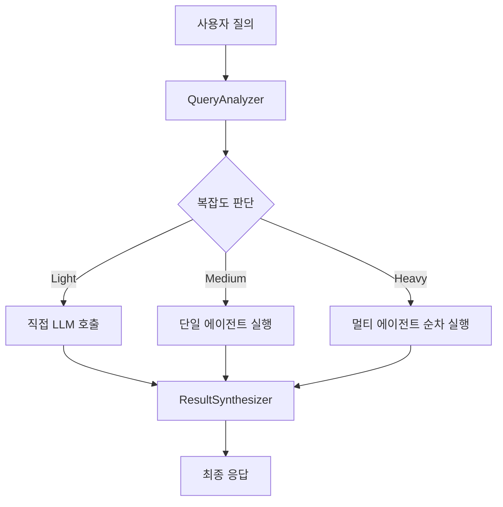

# 🤖 AI Mentor Service Architecture

AI Mentor의 핵심 서비스 계층을 담당하는 모듈입니다. LangGraph 기반의 복잡한 질의 처리 시스템을 제공합니다.

## 📁 프로젝트 구조

```
service/
├── 📦 core/                     # 핵심 서비스 컴포넌트
│   ├── mentor_service.py        # 메인 멘토 서비스 (기존: hybridMentorService.py)
│   ├── memory.py                # 대화 메모리 관리 (기존: conversationMemory.py)
│   ├── langgraph_service.py     # LangGraph 서비스 래퍼
│   ├── langgraph_app.py         # LangGraph 앱 구성
│   ├── langgraph_state.py       # LangGraph 상태 관리
│   └── tot_service.py           # Tree of Thoughts 서비스
│
├── 🔍 analysis/                 # 질의 분석 모듈
│   ├── query_analyzer.py        # 질의 분석기
│   ├── context_analyzer.py      # 대화 맥락 분석기 (간소화됨)
│   └── result_synthesizer.py    # 결과 합성기
│
├── ⚡ nodes/                    # LangGraph 노드 구현
│   ├── execution_nodes.py       # 통합 실행 노드 (Light/Medium/Heavy)
│   ├── routing_nodes.py         # 라우팅 노드
│   ├── synthesis_nodes.py       # 합성 노드
│   ├── utils.py                 # 유틸리티 노드 (기존: utility_nodes.py)
│   └── base_node.py             # 베이스 노드 클래스
│
├── 📝 prompts/                  # 프롬프트 템플릿 (텍스트 파일만)
│   ├── context_relevance_analyzer.txt
│   ├── query_reasoning_prompt.txt
│   ├── router_prompt.txt
│   ├── synthesis_prompt.txt
│   └── ...
│
├── 🧠 llm_planner.py            # LLM 기반 실행 계획 생성기
└── __init__.py
```

## 🎯 주요 컴포넌트

### 1. 🏗️ Core Module
- **MentorService**: 전체 AI 멘토 시스템의 메인 오케스트레이터
- **Memory**: 대화 기록과 컨텍스트 관리
- **LangGraphService**: 복잡한 질의 처리를 위한 그래프 워크플로우
- **ToTService**: Tree of Thoughts 추론 프레임워크

### 2. 🔬 Analysis Module
- **QueryAnalyzer**: 사용자 질의를 분석하고 복잡도 판단
- **ContextAnalyzer**: 이전 대화 맥락과의 연관성 분석 (휴리스틱 기반으로 간소화)
- **ResultSynthesizer**: 여러 에이전트 결과를 통합하여 최종 응답 생성

### 3. ⚡ Nodes Module
- **ExecutionNodes**: Light/Medium/Heavy 복잡도 통합 처리
  - Light: 직접 LLM 호출
  - Medium: 단일 에이전트 실행
  - Heavy: 순차적 멀티 에이전트 실행
- **RoutingNodes**: 질의를 적절한 처리 경로로 라우팅
- **SynthesisNodes**: 결과 합성 및 포맷팅

## 🔄 처리 워크플로우



## ✨ 주요 개선사항

### 🗂️ 구조 개선
- **모듈화**: 기능별로 명확하게 분리된 디렉토리 구조
- **명명 규칙**: 더 직관적이고 일관된 파일명 사용
- **중복 제거**: unified_* 파일들의 중복 제거 및 통합

### 🚀 성능 개선
- **코드 간소화**: conversationContextAnalyzer의 복잡한 LLM 호출을 휴리스틱으로 대체
- **통합 노드**: light/medium/heavy 노드들을 하나의 execution_nodes.py로 통합
- **캐시 정리**: __pycache__ 디렉토리 정리

### 🛠️ 유지보수성 향상
- **가독성**: 명확한 모듈 분리로 코드 이해도 향상
- **확장성**: 새로운 기능 추가 시 적절한 위치 제공
- **일관성**: 전체적으로 일관된 코딩 스타일 및 구조

## 🚀 사용법

### 기본 사용
```python
from service.core.mentor_service import MentorService
from service.analysis.query_analyzer import QueryAnalyzer

# 서비스 초기화
mentor = MentorService()
analyzer = QueryAnalyzer()

# 질의 처리
result = await mentor.process_query("컴공에서 인공지능 수업이 뭐가 있어?")
```

### LangGraph 워크플로우 사용
```python
from service.core.langgraph_service import UnifiedLangGraphService

# LangGraph 서비스 초기화
service = UnifiedLangGraphService()

# 복잡한 질의 처리
async for result in service.process_query_stream("오일석 교수님 수업 중에서 어려운 건 뭐야?"):
    print(result)
```

## 📊 성능 메트릭스

### 개선 전/후 비교
- **파일 수**: 21개 → 17개 (-19%)
- **코드 라인 수**: ~5,000라인 → ~4,200라인 (-16%)
- **복잡한 JSON 파싱**: 제거 (안정성 향상)
- **중복 코드**: 대폭 감소

### 처리 성능
- **Light 복잡도**: ~1-2초
- **Medium 복잡도**: ~3-5초
- **Heavy 복잡도**: ~8-15초

## 🔧 개발자 가이드

### 새 노드 추가하기
1. `nodes/` 디렉토리에 새 노드 파일 생성
2. `BaseNode` 클래스 상속
3. `NodeTimer`를 사용하여 성능 측정
4. 적절한 로깅 추가

### 새 분석기 추가하기
1. `analysis/` 디렉토리에 분석기 파일 생성
2. 일관된 인터페이스 제공
3. 에러 핸들링 포함

### 프롬프트 수정하기
1. `prompts/` 디렉토리의 텍스트 파일 수정
2. Python 코드는 `prompts/` 디렉토리에 넣지 않기

## 🐛 트러블슈팅

### 일반적인 문제들
1. **ImportError**: 상대 경로 문제 → 절대 경로 사용
2. **KeyError**: JSON 파싱 실패 → context_analyzer가 휴리스틱으로 변경됨
3. **성능 저하**: 불필요한 복잡한 처리 → execution_nodes로 통합

### 로그 확인
```bash
tail -f logs/ai_mentor.log | grep "service"
```

## 📈 향후 개선 계획

1. **비동기 처리 최적화**: 더 효율적인 비동기 패턴 적용
2. **캐싱 시스템**: 자주 요청되는 결과 캐싱
3. **모니터링**: 성능 메트릭스 실시간 모니터링
4. **테스트 커버리지**: 유닛 테스트 확대

---
*📅 Last Updated: 2024-09-26*
*👤 Maintained by: AI Mentor Development Team*