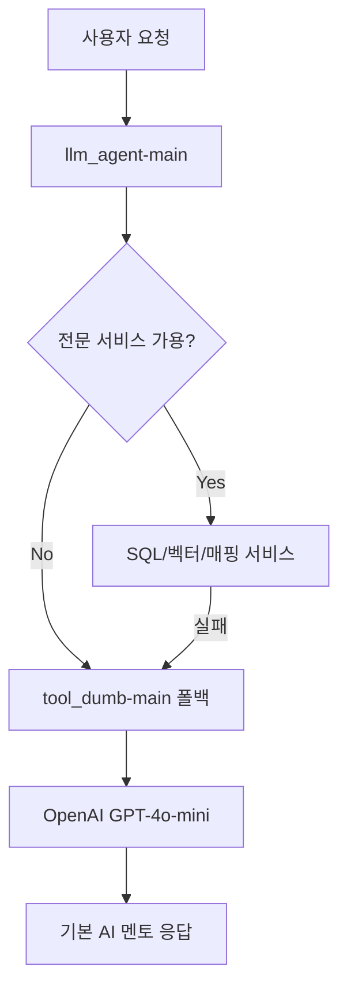

# 🛡️ LLM 폴백 서비스 (tool_dumb-main)

AI 멘토 시스템의 **시스템 안정성 보장**을 위한 폴백 서비스입니다. 다른 전문 서비스(SQL, 벡터 검색, 매핑 등)가 실패하거나 사용할 수 없을 때 **기본적인 LLM 응답**을 제공하여 시스템 전체가 다운되지 않도록 하는 **안전망 역할**을 합니다.

## 🎯 서비스 개요

### 핵심 역할
- **폴백 서비스**: 전문 서비스 실패 시 기본 LLM 응답 제공
- **시스템 안정성**: 전체 AI 멘토 시스템의 최후 방어선
- **간단한 질문 처리**: 복잡한 처리가 불필요한 일반적인 질문 응답
- **서비스 가용성**: 24/7 기본 AI 멘토링 서비스 보장

### 동작 원리


## 📁 프로젝트 구조

```
tool_dumb-main/
├── main.py                  # FastAPI 애플리케이션 진입점
├── requirements.txt         # Python 패키지 의존성
├── .env                     # 환경 변수 (OpenAI API 키 등)
├── Dockerfile              # Docker 컨테이너 설정
├──
├── controller/
│   └── controller.py        # FastAPI 라우터 및 API 엔드포인트
├──
├── service/
│   └── coreService.py       # 핵심 비즈니스 로직 처리
├──
└── util/
    └── llmClient.py         # OpenAI API 클라이언트 래퍼
```

## 🔧 설치 및 실행

### 1. 환경 설정

#### 필수 환경 변수 (.env 파일)
```bash
# OpenAI API 설정
OPENAI_API_KEY=your_openai_api_key_here

# 데이터베이스 설정 (사용하지 않지만 호환성을 위해 유지)
DB_HOST=your_db_host
DB_PASSWORD=your_db_password
```

#### 패키지 의존성 (requirements.txt)
```bash
fastapi        # 웹 프레임워크
uvicorn        # ASGI 서버
pydantic       # 데이터 검증
openai         # OpenAI API 클라이언트
python-dotenv  # 환경 변수 로딩
```

### 2. 로컬 실행

```bash
# 1. 가상환경 생성 및 활성화
python -m venv venv
source venv/bin/activate  # Linux/Mac
# 또는
venv\Scripts\activate     # Windows

# 2. 패키지 설치
pip install -r requirements.txt

# 3. 환경 변수 설정
cp .env.example .env
# .env 파일에서 OPENAI_API_KEY 설정

# 4. 서버 실행
python main.py
```

### 3. Docker 실행

```bash
# Docker 이미지 빌드
docker build -t tool-dumb-main .

# 컨테이너 실행
docker run -d \
  --name svc7998 \
  -p 7998:7998 \
  -e PORT=7998 \
  -e OPENAI_API_KEY=your_api_key \
  tool-dumb-main
```


### 엔드포인트

#### 1. 폴백 에이전트 API
```http
POST /agent
Content-Type: application/json

{
  "messages": [
    {
      "role": "user",
      "content": "전북대학교 컴퓨터공학과에 대해 알려주세요"
    }
  ]
}
```

**응답 예시:**
```json
{
  "message": "전북대학교 컴퓨터공학과는 1982년에 설립되어 현재까지 우수한 IT 인재를 양성하고 있습니다. 주요 교육 분야로는 소프트웨어 엔지니어링, 인공지능, 데이터베이스, 네트워크 보안 등이 있습니다..."
}
```

#### 2. 헬스 체크
```http
GET /health
```

**응답:**
```json
{
  "status": "healthy",
  "service": "llm-fallback",
  "port": 7998,
  "description": "LLM Fallback/General-Agent for system stability"
}
```

### 요청/응답 모델

#### Message 모델
```python
class Message(BaseModel):
    role: str      # "user", "assistant", "system"
    content: str   # 메시지 내용
```

#### RequestBody 모델
```python
class RequestBody(BaseModel):
    messages: List[Message]  # 대화 히스토리
```

## 🏗️ 코드 구조 상세

### 1. main.py - 애플리케이션 진입점

```python
import uvicorn
from fastapi import FastAPI
from controller.controller import router as agent_router

# FastAPI 앱 생성
app = FastAPI(
    title="AI Mentor Fallback Service",
    description="LLM Fallback/General-Agent for system stability",
    version="1.0"
)

# 라우터 등록
app.include_router(agent_router)

if __name__ == "__main__":
    # 포트 7998에서 서버 실행
    uvicorn.run("main:app", host="0.0.0.0", port=7998)
```

**주요 기능:**
- FastAPI 애플리케이션 초기화
- 컨트롤러 라우터 등록
- 포트 7998에서 서버 실행

### 2. controller/controller.py - API 라우터

```python
from fastapi import APIRouter, HTTPException
from pydantic import BaseModel
from typing import List
import logging
from service.coreService import CoreService

router = APIRouter()
core_service = CoreService()

class Message(BaseModel):
    role: str
    content: str

class RequestBody(BaseModel):
    messages: List[Message]

@router.post("/agent")
async def agent_api(data: RequestBody):
    """폴백 에이전트 API - 시스템 안정성을 위한 기본 LLM 서비스"""
    try:
        logger.info(f"폴백 서비스 요청: {len(data.messages)}개 메시지")

        # 서비스 계층으로 데이터 전달
        response = core_service.execute(data.messages)
        result = response.choices[0].message.content

        return {"message": result}
    except Exception as e:
        logger.error(f"폴백 서비스 오류: {e}")
        raise HTTPException(status_code=500, detail=f"폴백 서비스 오류: {str(e)}")

@router.get("/health")
async def health_check():
    """폴백 서비스 헬스 체크"""
    return {
        "status": "healthy",
        "service": "llm-fallback",
        "port": 7998,
        "description": "LLM Fallback/General-Agent for system stability"
    }
```

**주요 기능:**
- API 엔드포인트 정의 (`/agent`, `/health`)
- 요청 데이터 검증 (Pydantic 모델)
- 서비스 계층 호출 및 응답 처리
- 예외 처리 및 로깅

**함수별 상세:**
- `agent_api()`: 메인 폴백 처리 API
  - **입력**: RequestBody (messages 리스트)
  - **출력**: {"message": "AI 응답"}
  - **예외**: HTTPException (500 오류)

- `health_check()`: 서비스 상태 확인
  - **입력**: 없음
  - **출력**: 서비스 상태 정보

### 3. service/coreService.py - 핵심 비즈니스 로직

```python
from util.llmClient import LlmClient
from typing import List
import logging

class CoreService:
    """폴백 에이전트 코어 서비스"""

    def __init__(self):
        self.llmClient = LlmClient()
        logger.info("폴백 서비스 코어 서비스 초기화 완료")

    def execute(self, messages: List):
        """폴백 에이전트 실행 - 기본적인 LLM 처리"""
        logger.debug(f"폴백 서비스 실행: {len(messages)}개 메시지 처리")

        # 전북대 AI 멘토 시스템 전용 시스템 프롬프트
        system_prompt = """
당신은 전북대학교 AI 멘토링 시스템의 폴백 에이전트입니다.
다른 전문 서비스가 사용할 수 없을 때 기본적인 도움을 제공합니다.

다음 단계를 따라 답변해주세요:
1. 대화 기록 우선: 이전 대화에서 답을 찾을 수 있다면 그 정보를 활용하세요.
2. 일반 지식 보조: 대화 기록에 답이 없다면 일반적인 교육 지식으로 도움을 제공하세요.
3. 한국어 응답: 모든 답변은 한국어로 해주세요.

전문 서비스가 정상화되면 더 상세한 도움을 받을 수 있습니다.
"""

        # Pydantic 모델을 딕셔너리로 변환
        message_dicts = [msg.dict() for msg in messages]

        # 시스템 프롬프트 추가
        request_messages = [
            {"role": "system", "content": system_prompt},
            *message_dicts
        ]

        try:
            # OpenAI API 호출
            response = self.llmClient.call_llm(request_messages)
            logger.debug("폴백 서비스 LLM 응답 생성 성공")
            return response
        except Exception as e:
            logger.error(f"폴백 서비스 LLM 호출 오류: {e}")
            raise
```

**주요 기능:**
- LLM 클라이언트 초기화 및 관리
- 전북대 AI 멘토 시스템 전용 시스템 프롬프트 적용
- 메시지 포맷 변환 (Pydantic → Dict)
- OpenAI API 호출 및 응답 반환

**함수별 상세:**
- `__init__()`: 서비스 초기화
  - LlmClient 인스턴스 생성
  - 로깅 설정

- `execute(messages)`: 메인 처리 함수
  - **입력**: List[Message] (Pydantic 모델)
  - **처리**: 시스템 프롬프트 추가, 포맷 변환
  - **출력**: OpenAI API 응답 객체
  - **예외**: LLM 호출 오류 시 예외 전파

### 4. util/llmClient.py - OpenAI API 클라이언트

```python
from openai import OpenAI
from dotenv import load_dotenv
import os

load_dotenv()
api_key = os.getenv("OPENAI_API_KEY")

class LlmClient():
    def __init__(self):
        self.client = OpenAI(api_key=api_key)
        self.model = "gpt-4o-mini"  # 비용 효율적인 모델

    def call_llm(self, messages: list):
        """OpenAI API 호출"""
        return self.client.chat.completions.create(
            model=self.model,
            messages=messages,
            temperature=0.5  # 적당한 창의성
        )
```

**주요 기능:**
- OpenAI API 클라이언트 래퍼
- 환경 변수에서 API 키 로딩
- GPT-4o-mini 모델 사용 (비용 효율성)

**함수별 상세:**
- `__init__()`: 클라이언트 초기화
  - 환경 변수에서 API 키 로딩
  - OpenAI 클라이언트 생성
  - 기본 모델 설정 (gpt-4o-mini)

- `call_llm(messages)`: LLM API 호출
  - **입력**: List[Dict] (메시지 리스트)
  - **설정**: temperature=0.5 (균형 잡힌 응답)
  - **출력**: OpenAI ChatCompletion 객체

## 🔄 시스템 통합

### 1. 환경 변수 설정

#### restart_all.sh에서 설정
```bash
export LLM_FALLBACK_URL="${LLM_FALLBACK_URL:-http://svc7998:7998/agent}"
```

#### llm_agent-main에서 참조
```python
# config/settings.py
llm_fallback_url: str = "http://svc7998:7998/agent"
```

### 2. Docker 네트워크 통합

#### docker-compose.yml 설정
```yaml
svc7998:
  build:
    context: ./ai_modules/tool_dumb-main
    dockerfile: Dockerfile
  container_name: svc7998
  environment:
    - PORT=7998
    - TZ=Asia/Seoul
  ports:
    - "7998:7998"
  restart: unless-stopped
```

### 3. Nginx 리버스 프록시

#### 라우팅 설정
```nginx
location ^~ /api/fallback/ {
    proxy_pass http://svc7998:7998/;
}
```

### 4. 메인 시스템에서 호출

#### 폴백 호출 예시 (llm_agent-main)
```python
# handlers/base_handler.py의 get_fallback_message() 구현에서
async def call_fallback_service(user_message: str):
    async with httpx.AsyncClient() as client:
        response = await client.post(
            "http://svc7998:7998/agent",
            json={
                "messages": [
                    {"role": "user", "content": user_message}
                ]
            }
        )
        return response.json()["message"]
```

## 🛠️ 개발 가이드

### 1. 새로운 기능 추가

#### 커스텀 프롬프트 추가
```python
# service/coreService.py에서 시스템 프롬프트 수정
system_prompt = """
당신은 전북대학교 AI 멘토링 시스템의 폴백 에이전트입니다.

# 새로운 지시사항 추가
4. 특정 도메인 질문: 컴퓨터공학과 관련 질문에는 더 상세히 답변하세요.
5. 참고 링크 제공: 가능한 경우 전북대 공식 사이트 링크를 제공하세요.
"""
```

#### 새로운 엔드포인트 추가
```python
# controller/controller.py에 추가
@router.get("/status")
async def get_status():
    """서비스 상태 및 통계 정보"""
    return {
        "uptime": get_uptime(),
        "requests_processed": request_counter,
        "model": "gpt-4o-mini",
        "last_request": last_request_time
    }
```

### 2. 모델 변경

#### GPT 모델 업그레이드
```python
# util/llmClient.py에서 모델 변경
class LlmClient():
    def __init__(self):
        self.client = OpenAI(api_key=api_key)
        self.model = "gpt-4"  # 더 강력한 모델로 변경
        # 또는
        self.model = "gpt-3.5-turbo"  # 더 경제적인 모델로 변경
```

### 3. 로깅 강화

#### 상세 로깅 추가
```python
# 각 파일에 로깅 설정 추가
import logging

# 로그 포맷 설정
logging.basicConfig(
    level=logging.INFO,
    format='%(asctime)s - %(name)s - %(levelname)s - %(message)s',
    handlers=[
        logging.FileHandler('logs/fallback.log'),
        logging.StreamHandler()
    ]
)

logger = logging.getLogger(__name__)
```

### 4. 에러 핸들링 개선

#### 더 구체적인 예외 처리
```python
# service/coreService.py에서
async def execute(self, messages: List):
    try:
        response = self.llmClient.call_llm(request_messages)
        return response
    except openai.APIError as e:
        logger.error(f"OpenAI API 오류: {e}")
        raise HTTPException(status_code=503, detail="AI 서비스 일시 이용 불가")
    except openai.RateLimitError as e:
        logger.error(f"API 요청 한도 초과: {e}")
        raise HTTPException(status_code=429, detail="요청이 너무 많습니다")
    except Exception as e:
        logger.error(f"알 수 없는 오류: {e}")
        raise HTTPException(status_code=500, detail="서버 내부 오류")
```

## 🔍 모니터링 및 디버깅

### 1. 로그 확인

```bash
# 실시간 로그 모니터링
docker logs svc7998 -f

# 특정 로그 레벨 확인
docker logs svc7998 2>&1 | grep "ERROR"

# 최근 100줄 로그
docker logs svc7998 --tail 100
```

### 2. 헬스 체크

```bash
# 서비스 상태 확인
curl http://localhost:7998/health

# API 테스트
curl -X POST http://localhost:7998/agent \
  -H "Content-Type: application/json" \
  -d '{
    "messages": [
      {"role": "user", "content": "안녕하세요"}
    ]
  }'
```

### 3. 성능 모니터링

#### Docker 리소스 사용량
```bash
# CPU, 메모리 사용량 확인
docker stats svc7998

# 컨테이너 상세 정보
docker inspect svc7998
```

#### API 응답 시간 측정
```bash
# curl로 응답 시간 측정
curl -w "응답시간: %{time_total}초\n" \
  -X POST http://localhost:7998/agent \
  -H "Content-Type: application/json" \
  -d '{"messages": [{"role": "user", "content": "테스트"}]}'
```

## 🚀 배포 및 운영

### 1. 운영 환경 설정

#### 환경 변수 (운영)
```bash
# .env.production
OPENAI_API_KEY=prod_api_key_here
LOG_LEVEL=INFO
ENVIRONMENT=production
```

#### Docker 운영 배포
```bash
# 운영용 이미지 빌드
docker build -t tool-dumb-main:prod .

# 운영 컨테이너 실행
docker run -d \
  --name svc7998-prod \
  --restart unless-stopped \
  -p 7998:7998 \
  -e PORT=7998 \
  -e OPENAI_API_KEY=${OPENAI_API_KEY} \
  -e LOG_LEVEL=INFO \
  tool-dumb-main:prod
```

### 2. 백업 및 복구

#### 설정 백업
```bash
# 환경 설정 백업
cp .env .env.backup.$(date +%Y%m%d)

# Docker 이미지 백업
docker save tool-dumb-main:prod > tool-dumb-main-backup.tar
```
