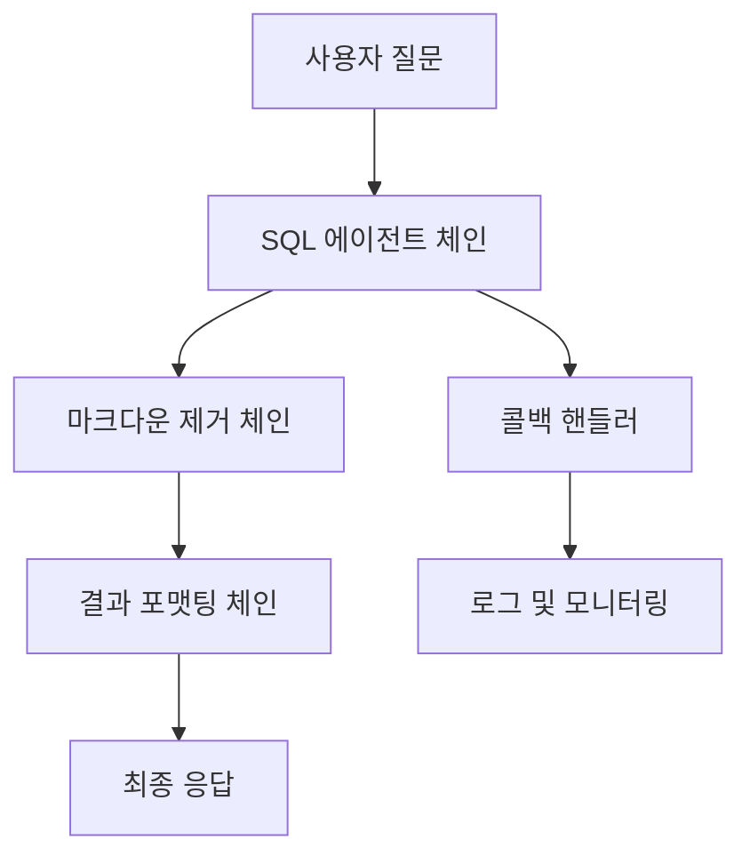

# 🔍 LangChain 기반 SQL 도구 (tool_sql-main)

AI 멘토 시스템의 SQL 모듈로, LangChain 프레임워크를 사용하여 자연어 질문을 SQL 쿼리로 변환하고 실행하는 지능형 SQL 처리 도구입니다.

## 🚀 주요 기능

### 1. LangChain 체인 기반 처리
- **순차 체인**: SQL 에이전트 → 마크다운 제거 → 결과 포맷팅
- **에러 핸들링**: 체인 실패 시 자동 폴백 처리
- **콜백 시스템**: 실행 과정 실시간 추적
- **SQL 에이전트**: LangChain의 `create_sql_agent`를 사용한 자연어-SQL 변환

### 2. 고급 로깅 시스템
- **구조화된 로깅**: JSON 형태의 상세 로그
- **성능 추적**: 각 단계별 실행 시간 측정
- **요청 추적**: Request ID 기반 요청별 로그 추적
- **컬러 콘솔**: 개발 환경에서 가독성 향상

### 3. 성능 모니터링
- **실시간 통계**: 성공률, 평균 처리 시간 등
- **메트릭 수집**: SQL 쿼리 수, 변경된 질문 수 등
- **헬스 체크**: 서비스 상태 모니터링

## 📁 프로젝트 구조

```
tool_sql-main/
├── main.py                    # 메인 애플리케이션 (FastAPI 서버)
├── requirements.txt           # Python 패키지 의존성
├── .env                       # 환경 변수 설정
├── Dockerfile                 # Docker 배포 설정
├── README.md                  # 프로젝트 문서
├── REFACTORING_GUIDE.md       # 리팩토링 가이드
├──
├── controller/
│   └── sqlController.py       # FastAPI 라우터 및 요청 처리
├──
├── service/
│   └── sqlCoreService.py      # 핵심 SQL 처리 서비스
├──
├── processors/
│   ├── sql_processor.py       # SQL 처리 핵심 로직
│   └── result_formatter.py    # 결과 포맷팅 처리
├──
├── chains/
│   ├── sql_chain_manager.py   # LangChain 체인 관리
│   └── callback_handlers.py   # 체인 실행 콜백 핸들러
├──
├── util/
│   ├── langchainLlmClient.py  # LangChain LLM 클라이언트
│   ├── dbClient.py            # 데이터베이스 연결 클라이언트
│   ├── prompt_loader.py       # 프롬프트 템플릿 로더
│   ├── logger_config.py       # 기본 로깅 설정
│   └── custom_logger.py       # 커스텀 로깅 시스템
├──
├── monitoring/
│   └── performance_monitor.py # 성능 모니터링 시스템
├──
├── prompts/                   # SQL 에이전트용 프롬프트 템플릿
└── logs/                      # 로그 파일 저장소
```

## 🔧 설치 및 실행

### 1. 환경 설정
```bash
# 1. 가상환경 생성 및 활성화
python -m venv venv
source venv/bin/activate  # Linux/Mac
# 또는
venv\Scripts\activate     # Windows

# 2. 패키지 설치
pip install -r requirements.txt

# 3. 환경 변수 설정 (.env 파일)
OPENAI_API_KEY=your_openai_api_key
DB_HOST=your_database_host
DB_USER=your_database_user
DB_PASSWORD=your_database_password
DB_NAME=your_database_name
```

### 2. 서버 실행
```bash
# 개발 서버 실행
python main.py

# 또는 uvicorn으로 직접 실행
uvicorn main:app --host 0.0.0.0 --port 7999 --reload
```

## 📚 API 사용법

### 기본 엔드포인트

#### 1. SQL 질문 처리
```http
POST /api/v1/agent
Content-Type: application/json

{
  "query": "오일석 교수님이 가르치는 수업 알려줘",
  "session_id": "optional-session-id",
  "include_debug": false
}
```

**응답 예시:**
```json
{
  "message": "오일석 교수님이 가르치는 수업 목록:\n1. 데이터베이스시스템 (컴퓨터공학과)\n2. 빅데이터처리 (컴퓨터공학과)",
  "request_id": "uuid-here",
  "processing_time": 1.234,
  "success": true,
  "debug_info": null
}
```

#### 2. 헬스 체크
```http
GET /api/v1/health
```

**응답:**
```json
{
  "status": "healthy",
  "timestamp": "2024-01-01T12:00:00",
  "uptime": 3600,
  "database_connected": true,
  "agent_ready": true
}
```

#### 3. 통계 조회
```http
GET /api/v1/stats
```

**응답:**
```json
{
  "total_requests": 150,
  "successful_requests": 142,
  "failed_requests": 8,
  "success_rate": 94.67,
  "average_processing_time": 1.234,
  "total_sql_queries": 89,
  "sanitized_queries": 23
}
```

### 요청 파라미터 상세

#### RequestBody 모델
- **query** (필수): 사용자 질문 (1-1000자)
- **session_id** (선택): 세션 추적용 ID
- **include_debug** (선택): 디버그 정보 포함 여부 (기본값: false)

#### ResponseBody 모델
- **message**: 처리된 결과 메시지
- **request_id**: 요청 추적용 UUID
- **processing_time**: 처리 시간 (초)
- **success**: 성공 여부
- **debug_info**: 디버그 정보 (include_debug=true일 때)

## 🏗️ 아키텍처 상세

### 1. 핵심 컴포넌트

#### SqlCoreService (`service/sqlCoreService.py`)
- **역할**: 메인 SQL 처리 서비스
- **기능**:
  - LangChain 체인 관리자 초기화
  - SQL 처리 실행 및 성능 모니터링
  - 에러 핸들링 및 폴백 처리

#### SqlController (`controller/sqlController.py`)
- **역할**: FastAPI 라우터 및 요청 처리
- **기능**:
  - HTTP 요청/응답 처리
  - 요청 컨텍스트 관리 (request_id, session_id 등)
  - 전역 서비스 인스턴스 관리 (싱글톤 패턴)

#### SqlProcessor (`processors/sql_processor.py`)
- **역할**: SQL 처리 핵심 로직
- **기능**:
  - LangChain SQL 에이전트 생성 및 실행
  - 데이터베이스 연결 관리
  - SQL 쿼리 실행 및 결과 반환

#### SqlChainManager (`chains/sql_chain_manager.py`)
- **역할**: LangChain 체인 관리
- **기능**:
  - 순차 체인 구성 (SQL 에이전트 → 마크다운 제거 → 포맷팅)
  - 콜백 핸들러 연결
  - 체인 실행 및 에러 처리

### 2. LangChain 체인 구조



#### 체인 실행 흐름
1. **SQL Agent Chain**: 자연어 → SQL 쿼리 변환 및 실행
2. **Markdown Removal Chain**: SQL 결과에서 마크다운 태그 제거
3. **Result Formatting Chain**: 사용자 친화적인 형태로 결과 포맷팅

### 3. 데이터베이스 연결

#### DbClient (`util/dbClient.py`)
- **지원 DB**: MySQL (PyMySQL 사용)
- **연결 방식**: 환경 변수 기반 연결 설정
- **기능**:
  - 데이터베이스 연결 풀 관리
  - SQLAlchemy 엔진 생성
  - LangChain SQLDatabase 래퍼 제공

#### 환경 변수 설정
```bash
DB_HOST=localhost
DB_USER=your_username
DB_PASSWORD=your_password
DB_NAME=your_database
DB_PORT=3306  # 선택사항 (기본값: 3306)
```

## 📊 로깅 및 모니터링

### 1. 로깅 시스템

#### 로그 레벨
- **DEBUG**: 상세한 디버깅 정보
- **INFO**: 일반적인 처리 정보
- **WARNING**: 주의가 필요한 상황
- **ERROR**: 오류 발생
- **CRITICAL**: 심각한 오류

#### 로그 형태
```json
{
  "timestamp": "2024-01-01T12:00:00",
  "level": "INFO",
  "logger": "sqlCoreService",
  "message": "SQL 에이전트 실행 완료",
  "request_id": "uuid-here",
  "processing_time": 1.234,
  "sql_queries_count": 2
}
```

#### 로깅 설정 (`util/custom_logger.py`)
- **콘솔 출력**: 개발 환경에서 컬러 로그
- **파일 출력**: `logs/sql_tool.log`에 구조화된 로그 저장
- **필터링**: 중요 로그만 표시하는 옵션

### 2. 성능 모니터링

#### PerformanceMonitor (`monitoring/performance_monitor.py`)
- **수집 메트릭**:
  - 총 요청 수
  - 성공/실패 요청 수
  - 평균 처리 시간
  - SQL 쿼리 생성 수
  - 질문 세니타이징 수

#### 모니터링 엔드포인트
```http
GET /api/v1/health      # 서비스 상태 확인
GET /api/v1/stats       # 상세 통계 조회
POST /api/v1/reset-stats # 통계 초기화
```

## 🛠️ 개발 가이드

### 1. 새로운 체인 추가

```python
# chains/sql_chain_manager.py에서

def setup_chains(self):
    # 새로운 체인 단계 추가
    self.new_processing_chain = (
        RunnableLambda(self._new_processing_step)
        .with_config({"callbacks": [CustomCallbackHandler()]})
    )

    # 메인 체인에 통합
    self.main_chain = (
        self.sql_agent_chain
        | self.new_processing_chain  # 새 체인 추가
        | self.markdown_removal_chain
        | self.result_formatting_chain
    )

def _new_processing_step(self, input_data: str) -> str:
    """새로운 처리 단계 구현"""
    # 처리 로직 구현
    return processed_result
```

### 2. 프롬프트 커스터마이징

```python
# util/prompt_loader.py에서

class PromptLoader:
    @staticmethod
    def load_sql_agent_prompt():
        """SQL 에이전트용 커스텀 프롬프트"""
        return """
        당신은 데이터베이스 전문가입니다.
        사용자의 자연어 질문을 정확한 SQL 쿼리로 변환하세요.

        특별 지시사항:
        - 한국어 질문을 이해하여 적절한 SQL을 생성하세요
        - 교수, 과목, 학과 정보를 정확히 매칭하세요
        - 결과는 사용자 친화적으로 포맷팅하세요
        """
```

### 3. 커스텀 콜백 핸들러

```python
# chains/callback_handlers.py에서

from langchain_core.callbacks import BaseCallbackHandler

class CustomCallbackHandler(BaseCallbackHandler):
    def on_chain_start(self, serialized, inputs, **kwargs):
        logger.info(f"🔗 체인 시작: {inputs}")

    def on_chain_end(self, outputs, **kwargs):
        logger.info(f"✅ 체인 완료: {outputs}")

    def on_chain_error(self, error, **kwargs):
        logger.error(f"❌ 체인 오류: {error}")
```

### 4. 로깅 추가

```python
from util.custom_logger import get_clean_logger

logger = get_clean_logger(__name__)

# 기본 로깅
logger.info("처리 완료")

# 성능 로깅 (processing_time 포함)
start_time = time.time()
# ... 처리 로직 ...
processing_time = time.time() - start_time
logger.info(f"SQL 실행 완료", extra={
    "processing_time": processing_time,
    "sql_queries_count": 3
})
```

## 🔍 디버깅

### 1. 로그 확인

```bash
# 실시간 로그 모니터링
tail -f logs/sql_tool.log

# 특정 레벨 로그만 확인
grep "ERROR" logs/sql_tool.log

# JSON 로그 파싱
cat logs/sql_tool.log | jq '.processing_time'
```

### 2. 성능 분석

```bash
# 처리 시간 분석
grep "processing_time" logs/sql_tool.log | jq '.processing_time' | sort -n

# SQL 쿼리 추적
grep "SQL_DEBUG" logs/sql_tool.log

# 에러 패턴 분석
grep "ERROR" logs/sql_tool.log | jq '.message'
```

### 3. 디버그 모드 사용

API 요청 시 `include_debug: true`를 설정하면 상세한 디버그 정보가 응답에 포함됩니다:

```json
{
  "query": "컴공 교수님들 알려줘",
  "include_debug": true
}
```

응답:
```json
{
  "message": "결과...",
  "debug_info": {
    "sql_queries": ["SELECT * FROM professors WHERE department = '컴퓨터공학과'"],
    "chain_steps": ["sql_agent", "markdown_removal", "formatting"],
    "processing_details": {...}
  }
}
```

## 🚀 배포

### 1. Docker 배포

```dockerfile
# Dockerfile
FROM python:3.9-slim

WORKDIR /app
COPY requirements.txt .
RUN pip install -r requirements.txt

COPY . .
EXPOSE 7999

CMD ["python", "main.py"]
```

```bash
# Docker 이미지 빌드 및 실행
docker build -t sql-tool .
docker run -p 7999:7999 --env-file .env sql-tool
```

### 2. 환경 변수

```bash
# 운영 환경 설정
LOG_LEVEL=INFO
LOG_FILE=logs/sql_tool.log
JSON_LOGGING=true
UVICORN_HOST=0.0.0.0
UVICORN_PORT=7999
```
