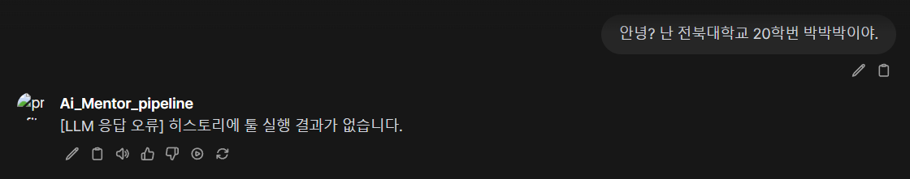
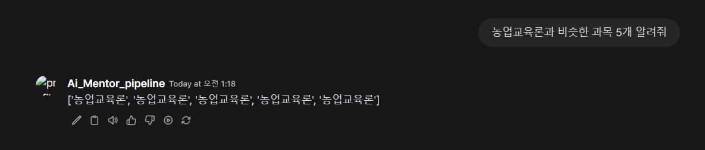
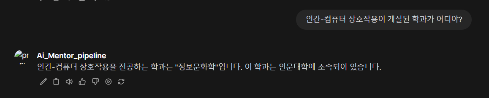
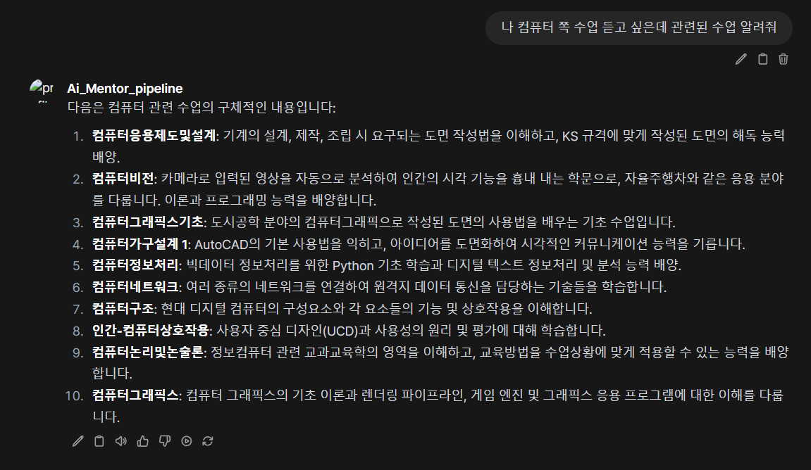
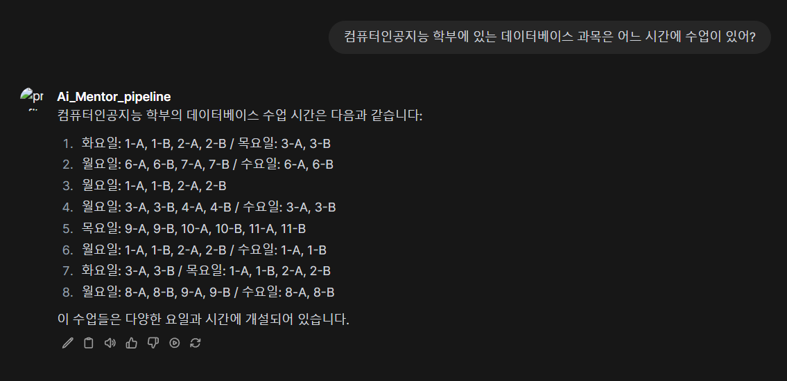
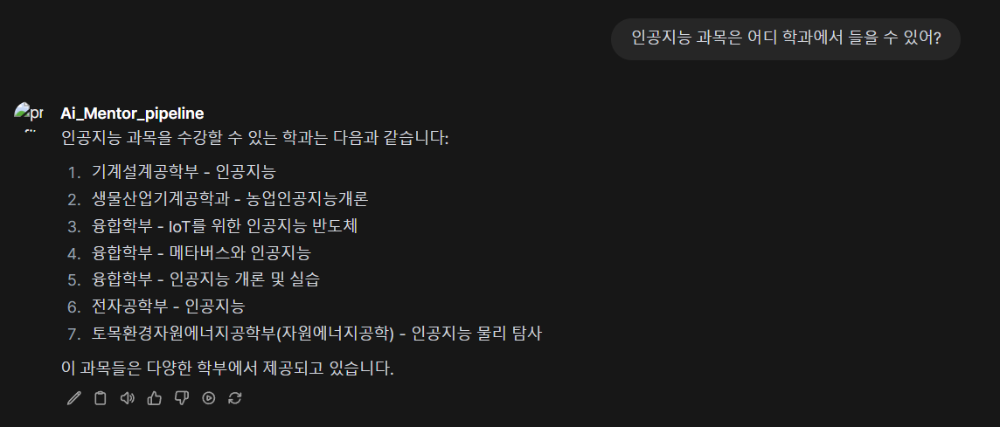
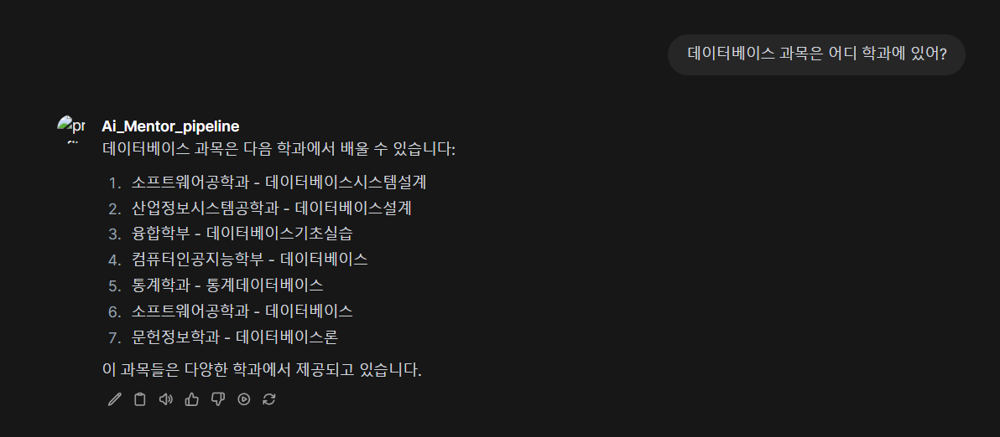
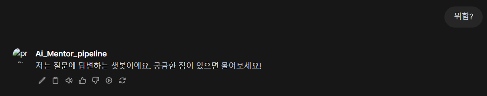
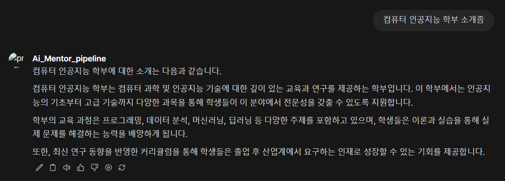

## ⚠️[문제 1] 첫 번째 스탭에 FINISH


```bash
User query: 안녕? 난 전북대학교 20학번 박박박이야.
response_data:  ['FINISH', 'FINISH', 'FINISH']
history_data: {'steps': []}
```

## ⚠️[문제 2] VECTOR_SEARCH를 선택했는데 해당하는 값이 없음

```bash
[llm-agent-main]
User query: 머신러닝이랑 비슷한 과목 5개 알려줘
response_data:  ['VECTOR_SEARCH', '{"count": 5, "key": "머신러닝"}', '이 도구를 선택한 이유는 머신러닝과 유사한 과목을 추천받기 위해서입니다. 이 도구를 사용하면 벡터 유사성 기반으로 비슷한 과목을 찾을 수 있습니다.']
사용할 api_url:  http://127.0.0.1:7997/search
INFO:     127.0.0.1:48120 - "POST /agent HTTP/1.1" 500 Internal Server Error
ERROR:    Exception in ASGI application

[faiss]
raise ValueError(f"키 '{key}'에 해당하는 벡터가 없습니다.")
ValueError: 키 '머신러닝'에 해당하는 벡터가 없습니다.
```
## ⚠️[문제 3] 너무 많은 반복과 비슷한 과목을 찾지 못 한 결과

```bash
{'step_number': 41, 'tool_name': 'VECTOR_SEARCH', 'tool_input': '{"count": 5, "key": "농업교육론"}', 'tool_response': "['농업교육론', '농업교육론', '농업교육론', '농업교육론', '농업교육론']", 'reason': 'I chose the VECTOR_SEARCH tool to find courses similar to "농업교육론" based on vector similarity. This approach allows me to recommend several relevant courses that align closely in content or theme, effectively addressing the client\'s request for five similar subjects.'}]}
```


## ⚠️ [문제 4] step을 여러번 거치면서 답이 이상하게 바뀜

```bash
User query: 인간-컴퓨터 상호작용이 개설된 학과가 어디야?
response_data:  ['JBNU_SQL', '{"query": "인간-컴퓨터 상호작용이 개설된 학과"}', '이 도구는 전북대학교의 학과에 대한 정보를 얻기 위해 선택했습니다. 질문이 특정 학과에 관한 것이므로 JBNU_SQL 도구를 사용하여 관련 데이터를 조회합니다.']
사용할 api_url:  http://127.0.0.1:7999/agent
tool 사용 결과:  인간-컴퓨터 상호작용을 전공으로 하는 학과는 **컴퓨터인공지능학부**입니다.
-------------------------------------------------------------------------------------------------------------
response_data:  ['JBNU_SQL', '{"query": "인간-컴퓨터 상호작용이 개설된 학과는 어디야?"}', '인간-컴퓨터 상호작용을 전공으로 하는 학과에 대한 정보를 얻기 위해 JBNU_SQL 도구를 선택하여 호출하였습니다. 이 도구를 통해 관련 학과의 정보를 검색하였고, 결과로서 해당 전공이 개설된 학과를 확인할 수 있었습니다. \n\nFINISH', 'FINISH', 'FINISH']
사용할 api_url:  http://127.0.0.1:7999/agent
tool 사용 결과:  인간-컴퓨터 상호작용을 전공하는 학과는 "정보문화학"입니다. 이 학과는 인문대학에 소속되어 있습니다.
-------------------------------------------------------------------------------------------------------------
response_data:  ['FINISH', 'FINISH', 'FINISH']
history_data: {'steps': [{'step_number': 1, 'tool_name': 'JBNU_SQL', 'tool_input': '{"query": "인간-컴퓨터 상호작용이 개설된 학과"}', 'tool_response': '인간-컴퓨터 상호작용을 전공으로 하는 학과는 **컴퓨터인공지능학부**입니다.', 'reason': '이 도구는 전북대학교의 학 과에 대한 정보를 얻기 위해 선택했습니다. 질문이 특정 학과에 관한 것이므로 JBNU_SQL 도구를 사용하여 관련 데이터를 조회합니다.'}, {'step_number': 2, 'tool_name': 'JBNU_SQL', 'tool_input': '{"query": "인간-컴퓨터 상호작용이 개설된 학과는 어디야?"}', 'tool_response': '인간-컴퓨터 상호작용을 전공하는 학과는 "정보문화학"입니다. 이 학과는 인문대학에 소속되어 있습니다.', 'reason': '인간-컴퓨터 상호작용을 전공으로 하는 학과에 대한 정보를 얻기 위해 JBNU_SQL 도구를 선택하여 호출하였습니다. 이 도구를 통해 관련 학과의 정보를 검색하였고, 결과로서 해당 전공이 개설된 학과를 확인할 수 있었습니다. \n\nFINISH'}]}
```
## ⚠️ [문제 5] 진위 여부 확인 필요


```bash
User query: 나 컴퓨터 쪽 수업 듣고 싶은데 관련된 수업 알려줘
response_data:  ['JBNU_SQL', '{"query": "컴퓨터 관련 수업"}', "나는 'JBNU_SQL' 도구를 사용하여 Jeonbuk University에서 제공하는 컴퓨터 관련 수업에 대한 정보를 찾도록 요청할 것이다. 이 도구는 대학의 강의 및 과목에 대한 데이터를 효과적으로 검색할 수 있다."]
사용할 api_url:  http://127.0.0.1:7999/agent
tool 사용 결과:  다음은 컴퓨터 관련 수업의 구체적인 내용입니다:
중략
response_data:  ['FINISH', 'FINISH', 'FINISH']
history_data: {'steps': [{'step_number': 1, ...
```

```bash
User query: 컴퓨터인공지능 학부에 있는 데이터베이스 과목은 어느 시간에 수업이 있어?
response_data:  ['JBNU_SQL', '{"query": "컴퓨터인공지능 학부에 있는 데이터베이스 과목은 어느 시간에 수업이 있어?"}', '이 도구를 선택한 이유는 사용자의 질문이 JBNU의 특정 학부와 과목에 대한 정보를 필요로 하기 때문에 SQL 쿼리를 사용하여 해당 정보를 데이터베이스에서  조회하려고 했습니다.']
사용할 api_url:  http://127.0.0.1:7999/agent
tool 사용 결과:  컴퓨터인공지능 학부의 데이터베이스 수업 시간은 다음과 같습니다:

1. 화요일: 1-A, 1-B, 2-A, 2-B / 목요일: 3-A, 3-B
2. 월요일: 6-A, 6-B, 7-A, 7-B / 수요일: 6-A, 6-B
3. 월요일: 1-A, 1-B, 2-A, 2-B
4. 월요일: 3-A, 3-B, 4-A, 4-B / 수요일: 3-A, 3-B
5. 목요일: 9-A, 9-B, 10-A, 10-B, 11-A, 11-B
6. 월요일: 1-A, 1-B, 2-A, 2-B / 수요일: 1-A, 1-B
7. 화요일: 3-A, 3-B / 목요일: 1-A, 1-B, 2-A, 2-B
8. 월요일: 8-A, 8-B, 9-A, 9-B / 수요일: 8-A, 8-B

이 수업들은 다양한 요일과 시간에 개설되어 있습니다.
-------------------------------------------------------------------------------------------------------------
response_data:  ['FINISH', 'FINISH', 'FINISH']
history_data: {'steps': [{'step_number': 1, 'tool_name': 'JBNU_SQL', 'tool_input': '{"query": "컴퓨터인공지능 학부에 있는 데이터베이스 과목은 어느 시간에 수업이 있어?"}', 'tool_response': '컴퓨터인공지능 학부의 데이터베이스 수업 시간은 다음과 같습니다:\n\n1. 화요일: 1-A, 1-B, 2-A, 2-B / 목요일: 3-A, 3-B\n2. 월요일: 6-A, 6-B, 7-A, 7-B / 수요일: 6-A, 6-B\n3. 월요일: 1-A, 1-B, 2-A, 2-B\n4. 월요일: 3-A, 3-B, 4-A, 4-B / 수요일: 3-A, 3-B\n5. 목요일: 9-A, 9-B, 10-A, 10-B, 11-A, 11-B\n6. 월요일: 1-A, 1-B, 2-A, 2-B / 수요일: 1-A, 1-B\n7. 화요일: 3-A, 3-B / 목요일: 1-A, 1-B, 2-A, 2-B\n8. 월요일: 8-A, 8-B, 9-A, 9-B / 수요일: 8-A, 8-B\n\n이 수업들은 다양한 요일과 시간에 개설되어 있습니다.', 'reason': '이 도구를 선택한 이유는 사용자의 질문이 JBNU의 특정 학부와 과목에 대한 정보를 필요로 하기 때문에 SQL 쿼리를 사용하여 해당 정보를 데이터베이스에서 조회하려고 했습니다.'}]}
```



```bash
User query: 인공지능 과목은 어디 학과에서 들을 수 있어?
response_data:  ['JBNU_SQL', '{"query": "인공지능 과목은 어디 학과에서 들을 수 있어?"}', 'The question pertains to the courses offered at Jeonbuk University, so the JBNU_SQL tool is suitable for retrieving information about the departments offering artificial intelligence courses.']
사용할 api_url:  http://127.0.0.1:7999/agent
tool 사용 결과:  인공지능 과목을 수강할 수 있는 학과는 다음과 같습니다:

1. 기계설계공학부 - 인공지능
2. 생물산업기계공학과 - 농업인공지능개론
3. 융합학부 - IoT를 위한 인공지능 반도체
4. 융합학부 - 메타버스와 인공지능
5. 융합학부 - 인공지능 개론 및 실습
6. 전자공학부 - 인공지능
7. 토목환경자원에너지공학부(자원에너지공학) - 인공지능 물리 탐사

이 과목들은 다양한 학부에서 제공되고 있습니다.
-------------------------------------------------------------------------------------------------------------
response_data:  ['FINISH', 'FINISH', 'FINISH']
history_data: {'steps': [{'step_number': 1, 'tool_name': 'JBNU_SQL', 'tool_input': '{"query": "인공지능 과목은 어디 학과에서 들을 수 있어?"}', 'tool_response': '인공지능 과목을 수강할 수 있는 학과는 다음과 같습니다:\n\n1. 기계설계공학부 - 인공지능\n2. 생물산업기계 공학과 - 농업인공지능개론\n3. 융합학부 - IoT를 위한 인공지능 반도체\n4. 융합학부 - 메타버스와 인공지능\n5. 융합학부 - 인공지능 개론 및 실습\n6. 전자공학부 - 인공지능\n7. 토목환경자원에너지공학부(자원에너지공학) - 인공지능 물리 탐사\n\n이 과목들은 다양한 학부에서 제공되고 있습니다.', 'reason': 'The question pertains to the courses offered at Jeonbuk University, so the JBNU_SQL tool is suitable for retrieving information about the departments offering artificial intelligence courses.'}]}
```


```bash
User query: 데이터베이스 과목은 어디 학과에 있어?
response_data:  ['JBNU_SQL', '{"query": "데이터베이스 과목은 어디 학과에 있어?"}', "I chose the JBNU_SQL tool to retrieve specific information about the location of the Database course within the university's departments, as the user's question directly pertains to the courses offered at Jeonbuk University."]
사용할 api_url:  http://127.0.0.1:7999/agent
tool 사용 결과:  데이터베이스 과목은 다음 학과에서 배울 수 있습니다:

1. 소프트웨어공학과 - 데이터베이스시스템설계
2. 산업정보시스템공학과 - 데이터베이스설계
3. 융합학부 - 데이터베이스기초실습
4. 컴퓨터인공지능학부 - 데이터베이스
5. 통계학과 - 통계데이터베이스
6. 소프트웨어공학과 - 데이터베이스
7. 문헌정보학과 - 데이터베이스론

이 과목들은 다양한 학과에서 제공되고 있습니다.
-------------------------------------------------------------------------------------------------------------
response_data:  ['FINISH', 'FINISH', 'FINISH']
history_data: {'steps': [{'step_number': 1, 'tool_name': 'JBNU_SQL', 'tool_input': '{"query": "데이터베이스 과목은 어디 학과에 있어?"}', 'tool_response': '데이터베이스 과목은 다음 학과에서 배울 수 있습니다:\n\n1. 소프트웨어공학과 - 데이터베이스시스템설계\n2. 산업정보시스템공학과 - 데이터베이스설계\n3. 융합학부 - 데이터베이스기초실습\n4. 컴퓨터인공지능학부 - 데이터베이스\n5. 통계학과 - 통계데이터베이스\n6. 소프트웨어공학과 - 데이터베이스\n7. 문헌정보학과 - 데이터베이스론\n\n이 과목들은 다양한 학과에서 제공되고 있습니다.', 'reason': "I chose the JBNU_SQL tool to retrieve specific information about the location of the Database course within the university's departments, as the user's question directly pertains to the courses offered at Jeonbuk University."}]}
```
## ✅ FALLBACK 정상 출력


```bash
User query: 뭐함?
response_data:  ['FALLBACK', '{"query": "뭐함?"}', "The user's question is quite general and not specifically related to Jeonbuk University, so I am using the Fallback tool to provide a general response."]
사용할 api_url:  http://127.0.0.1:7998/agent
tool 사용 결과:  저는 질문에 답변하는 AI 챗봇이에요. 궁금한 점이 있으면 물어보세요!
-------------------------------------------------------------------------------------------------------------
response_data:  ['FALLBACK', '{"query": "뭐함?"}', "The user's question is quite general and not specifically related to Jeonbuk University, so I am using the Fallback tool to provide a general response."]
사용할 api_url:  http://127.0.0.1:7998/agent
tool 사용 결과:  저는 질문에 답변하는 AI 챗봇입니다. 무엇을 도와드릴까요?
-------------------------------------------------------------------------------------------------------------
response_data:  ['FALLBACK', '{"query": "뭐함?"}', "The user's question is quite general and does not specifically pertain to Jeonbuk University, so I chose the FALLBACK tool to provide a relevant response."]
사용할 api_url:  http://127.0.0.1:7998/agent
tool 사용 결과:  저는 질문에 답변하는 챗봇이에요. 궁금한 점이 있으면 물어보세요!
-------------------------------------------------------------------------------------------------------------
response_data:  ['FINISH', 'FINISH', 'FINISH']
history_data: {'steps': [{'step_number': 1, 'tool_name': 'FALLBACK', 'tool_input': '{"query": "뭐함?"}', 'tool_response': '저는 질문에 답변하는 AI 챗봇이에요. 궁금한 점이 있으면 물어보세요!', 'reason': "The user's question is quite general and not specifically related to Jeonbuk University, so I am using the Fallback tool to provide a general response."}, {'step_number': 2, 'tool_name': 'FALLBACK', 'tool_input': '{"query": "뭐함?"}', 'tool_response': '저는 질문에 답변하는 AI 챗봇입니다. 무엇을 도와드릴까요?', 'reason': "The user's question is quite general and not specifically related to Jeonbuk University, so I am using the Fallback tool to provide a general response."}, {'step_number': 3, 'tool_name': 'FALLBACK', 'tool_input': '{"query": "뭐함?"}', 'tool_response': '저는 질문에 답변하는 챗봇이에요. 궁금한 점이 있으면 물어보세요!', 'reason': "The user's question is quite general and does not specifically pertain to Jeonbuk University, so I chose the FALLBACK tool to provide a relevant response."}]}
```
## ✅ JBNU_SQL 정상 출력

```bash
User query: 컴퓨터 인공지능 학부 소개좀
response_data:  ['JBNU_SQL', '{"query": "컴퓨터 인공지능 학부 소개"}', "I selected the JBNU_SQL tool to fetch specific information regarding the Computer Artificial Intelligence Department at Jeonbuk University, as it is tailored for queries related to the university's colleges, departments, and courses. This should provide a comprehensive introduction to the department."]
사용할 api_url:  http://127.0.0.1:7999/agent
tool 사용 결과:  컴퓨터 인공지능 학부에 대한 소개는 다음과 같습니다.

컴퓨터 인공지능 학부는 컴퓨터 과학 및 인공지능 기술에 대한 깊이 있는 교육과 연구를 제공하는 학부입니다. 이 학부에서는 인공지능의 기초부터 고급 기술까지 다양한 과목을 통해 학생들이 이 분야에서 전문성을 갖출 수 있도록 지원합니다.

학부의 교육 과정은 프로그래밍, 데이터 분석, 머신러닝, 딥러닝 등 다양한 주제를 포함하고 있으며, 학생들은 이론과 실습을 통해 실제 문제를 해결하는 능력을 배양하게 됩니다.

또한, 최신 연구 동향을 반영한 커리큘럼을 통해 학생들은 졸업 후 산업계에서 요구하는 인재로 성장할 수 있는 기회를 제공합니다.
-------------------------------------------------------------------------------------------------------------
response_data:  ['FINISH', 'FINISH', 'FINISH']
history_data: {'steps': [{'step_number': 1, 'tool_name': 'JBNU_SQL', 'tool_input': '{"query": "컴퓨터 인공지능 학부 소개"}', 'tool_response': '컴퓨터 인공지능 학부에 대한 소개는 다음과 같습니다.\n\n컴퓨터 인공지능 학부는 컴퓨터 과학 및 인공지능 기술에 대한 깊이 있 는 교육과 연구를 제공하는 학부입니다. 이 학부에서는 인공지능의 기초부터 고급 기술까지 다양한 과목을 통해 학생들이 이 분야에서 전문성을 갖출 수 있도록 지원합니다. \n\n학부의 교육 과정은 프로그래밍, 데이터 분석, 머신러닝, 딥러닝 등 다양한 주제를 포함하고 있으며, 학생들은 이론과 실습을 통해 실제 문제를 해결하는 능력을 배양하게 됩니다. \n\n또한, 최신 연구 동향을 반영한 커리큘럼을 통해 학생들은 졸업 후 산업계에서 요구하는 인재로 성장할 수 있는 기회를 제공합니다.', 'reason': "I selected the JBNU_SQL tool to fetch specific information regarding the Computer Artificial Intelligence Department at Jeonbuk University, as it is tailored for queries related to the university's colleges, departments, and courses. This should provide a comprehensive introduction to the department."}]}
```